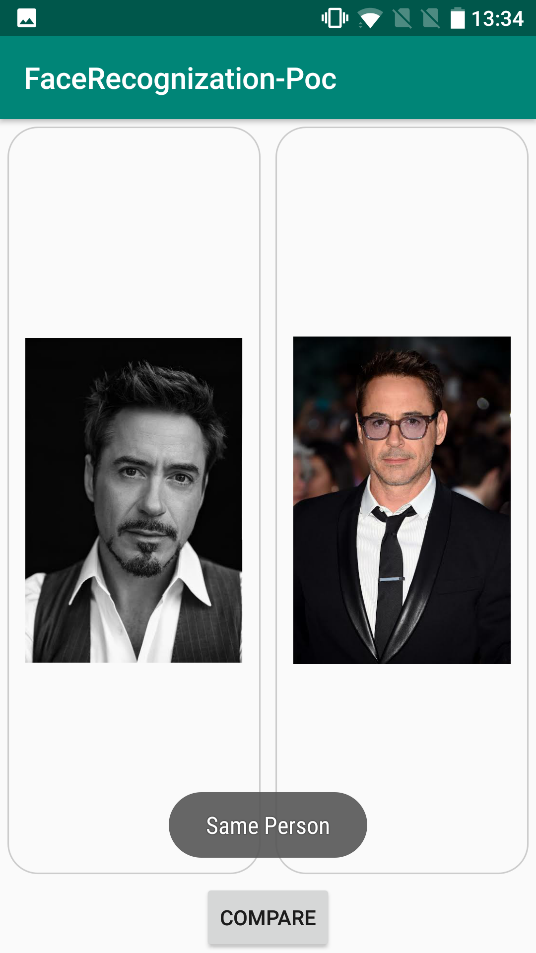
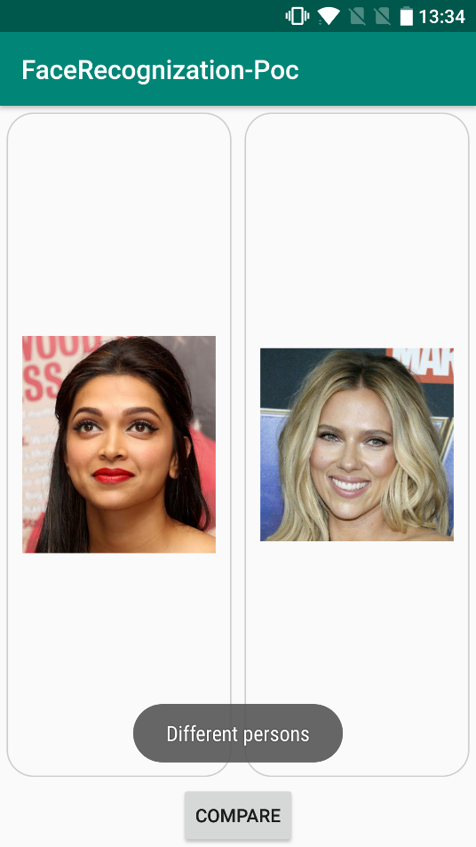

# Offline Face Detection & Face login using FaceNet

Most of the face detection systems are online which makes apps dependent on server and increases latency.
To overcome this problems we made this ofline app which compares two or more images to predict whether faces identified in both 
images are of the same person or not, also gives you feature of face login.

The project uses following tools.
* [FaceNet](https://arxiv.org/pdf/1503.03832.pdf)
* [MTCNN](https://kpzhang93.github.io/MTCNN_face_detection_alignment/paper/spl.pdf)
* [Tensorflow](https://www.tensorflow.org/lite/guide/android)

## Screenshots

  

     

  

 
